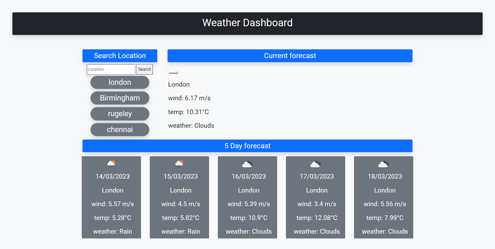

# Weather Dashboard
This applications purpose is to give accurate readings of the weather which the user inputs themselves, using openweathermap API. Once they enter their location of choice, they are greated with 2 groups of information, the current forecast and a 5 day forecast.
This assignment was meant to test my ability using API's, namely bootstrap and openweathermap API. And get me to practice all the skills i have already learned during the course.  

## Screenshot

## How to access the page
Deployed Webpage: https://jake-orch.github.io/Weather-dashboard/
GitHub Repository: https://github.com/Jake-Orch/Weather-dashboard
